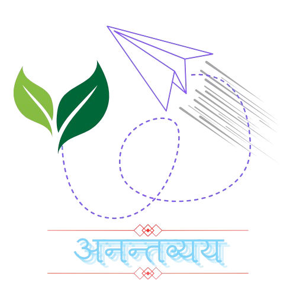

<h1>
    
</h1>

<h1 style="text-align:center;">
    अनन्तव्यय
</h1>

<h4 style="text-align:center">"Where Boundless meets Effortless"</h4>

`Anantavyay is a programming language that is as simple as Python, but as efficient as C. It also supports all existing Python libraries.`

### Documentation📃
To be added...